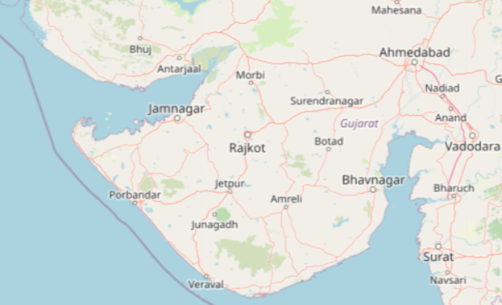
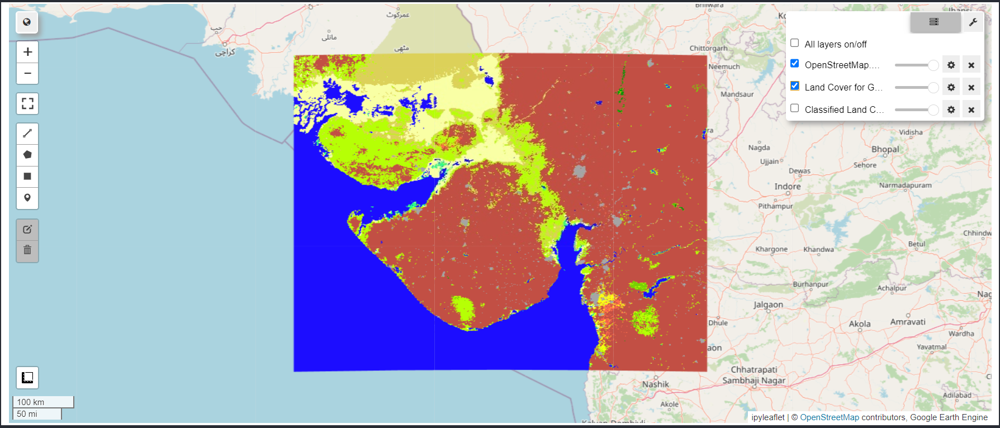
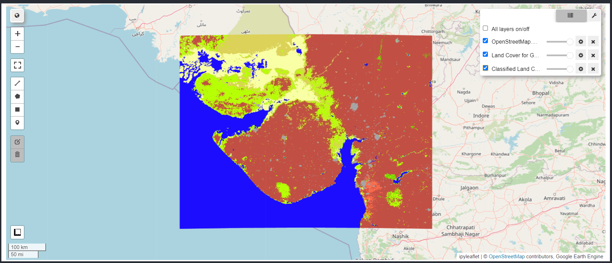

# Land Cover Classification Project 🌍


This project utilizes Google Earth Engine to perform land cover classification for the region of Gujarat using the MODIS Land Cover Type dataset. It implements a Random Forest classifier to predict land cover types based on sampled data.

---
## Features

- Land cover classification using `MODIS` dataset
- Comapring a custom classified layer to landcover dataset
- Visualization of classified results
- Export of training points and classified results in GeoJSON format

---
## Installation

1. Clone the repository:
   ```bash
   git clone https://github.com/arnabsaha7/Land-Cover-Classification.git
   ```
2. Navigate to the project directory:
   ```bash
   cd Land-Cover-Classification
   ```
3. Install the required packages:
   ```bash
   pip install -r requirements.txt
   ```
---
## Usage

1. Ensure you have Google Earth Engine access.
2. Set necessary IAM Roles in [Google Console](https://console.cloud.google.com/) 
3. Run the main script:
   ```bash
   python land_cover_classification.py
   ```
---
## Results

### Output Images

| Map | Land Cover | Classified Land Cover |
|-----|------------|-----------------------|
|  |  |  |
| *Map of Gujarat*       | *Land Cover Types*       | *Classified Land Cover*    |

### Exported Data

- The classified land cover and training points are exported as GeoJSON files located in the `json` folder.

## Contributing

Contributions are welcome! Please create a pull request or open an issue for any enhancements or bugs.

